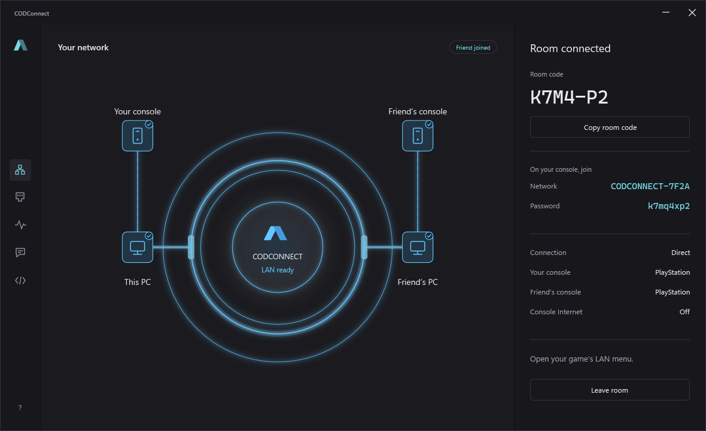
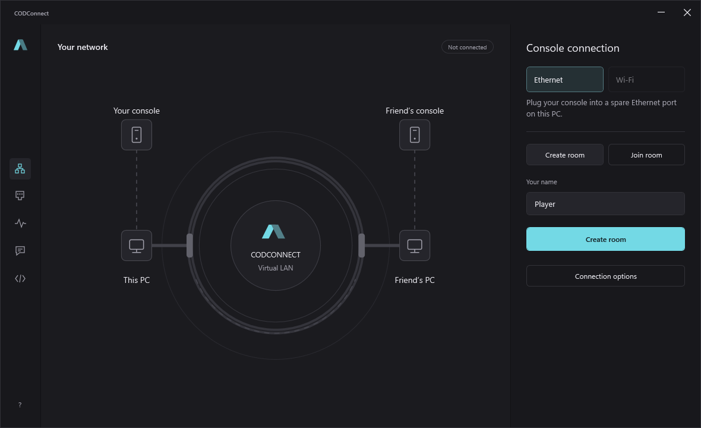
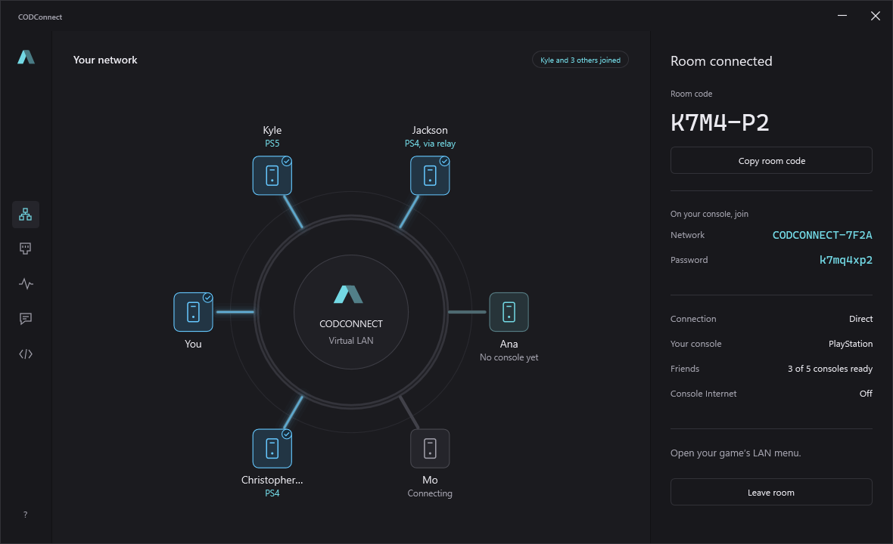
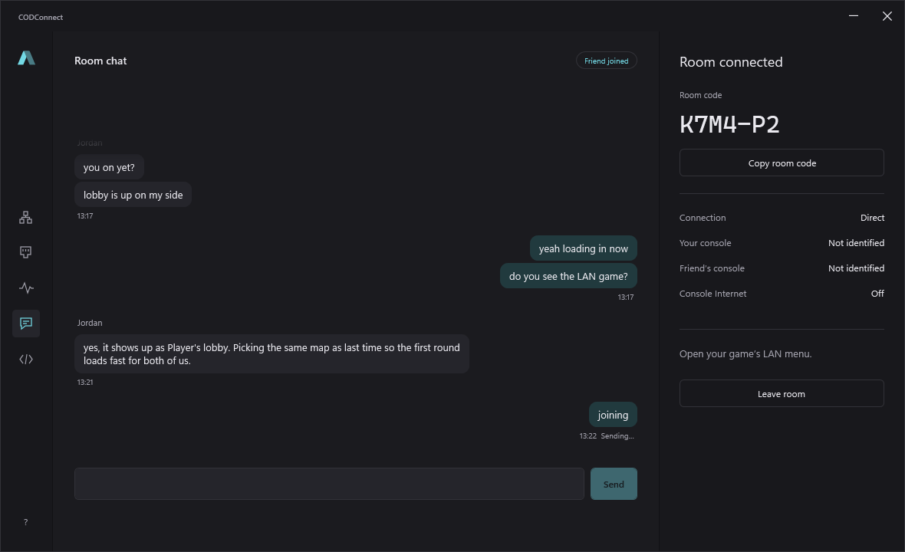
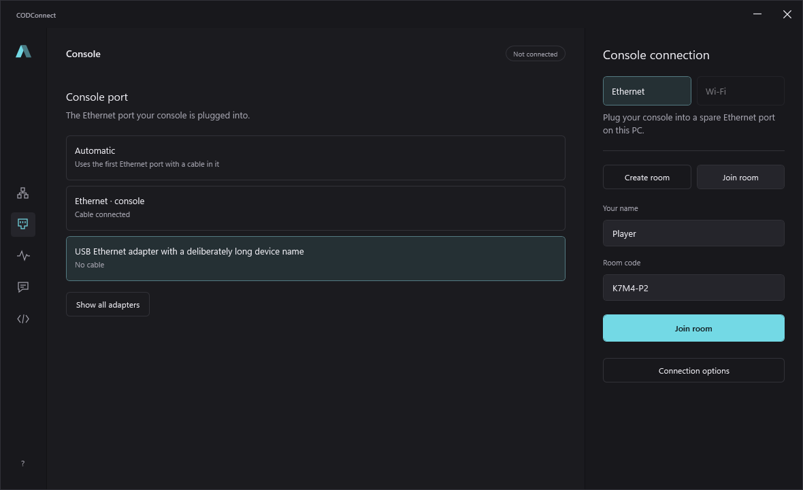
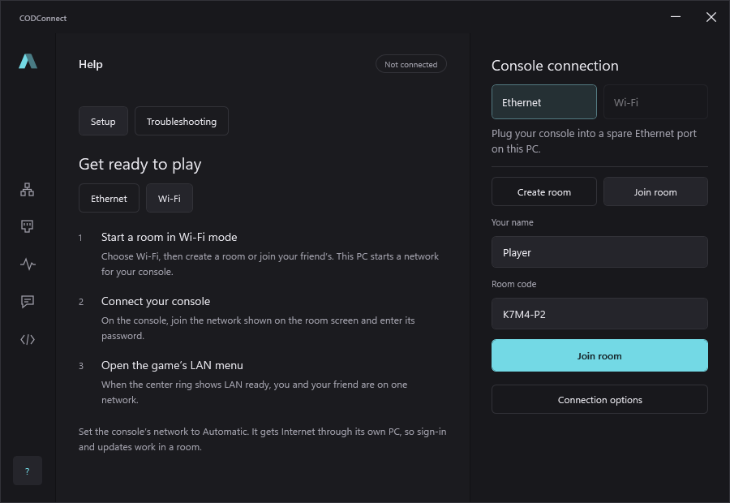
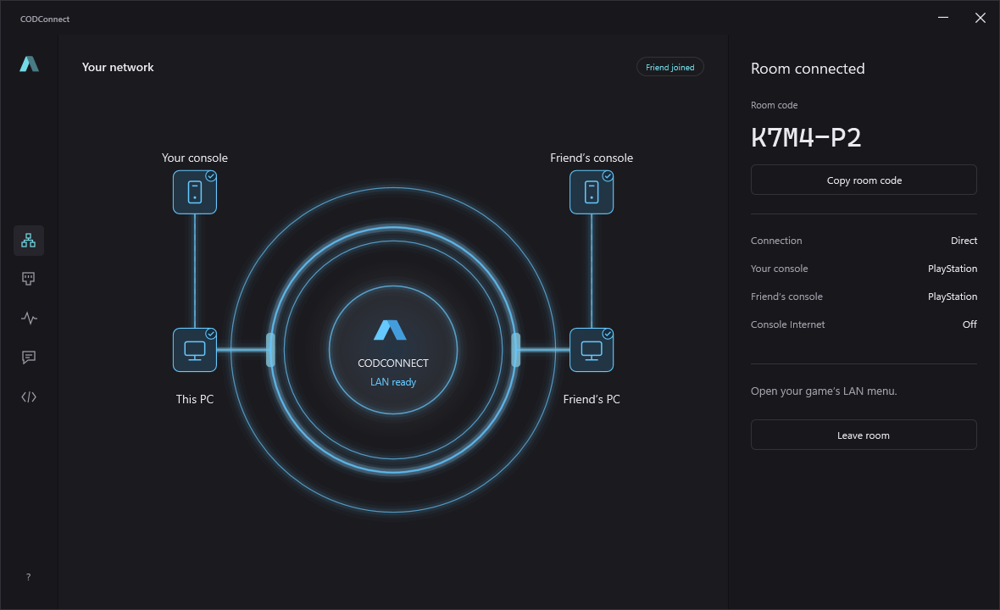

# CODCONNECT

CODCONNECT is a Windows app that connects up to six consoles in different homes on one LAN.
It was originally made for LAN recoveries, but despite the name it works with any game that has
a LAN mode: it connects the consoles, not a particular game.

## Screenshots

| | |
| --- | --- |
|  |  |
|  |  |
|  |  |

## What you need

- A Windows 10 or 11 PC for each player
- [Npcap](https://npcap.com/#download) (free)
- A way to connect your console to that PC:
  - **Wi-Fi (recommended):** the PC creates a Wi-Fi network for your console. Your PC's Wi-Fi
    adapter must support Windows Mobile Hotspot.
  - **Ethernet:** a spare Ethernet port on the PC and a cable to the console.

## Install

1. Download and install [Npcap](https://npcap.com/#download).
2. Run the CODCONNECT installer. At the end it opens the SoftEther VPN Client setup: finish it,
   it installs the network adapter CODCONNECT uses.
3. Open CODCONNECT and check **Diagnostics**: everything should be running and responding.

The first time you create or join a room, CODCONNECT sets up its virtual adapters. This takes a
minute or two.

## Play

1. Choose how your console connects: **Wi-Fi** or **Ethernet**.
2. **Create a room** and send the code to your friends, or **join** with a code someone sent you.
3. Connect your console:
   - **Wi-Fi:** on the console, join the network CODCONNECT shows and enter its password.
   - **Ethernet:** plug the console into the PC's spare Ethernet port, choose a wired
     connection on the console and leave its IP settings on Automatic.
4. Open your game's LAN mode. Where it is depends on the game.

## Troubleshooting

- **Friends can't connect:** allow CODCONNECT through Windows Firewall. The app's
  **Help > Troubleshooting** walks you through it.
- **Npcap or the SoftEther VPN Client is missing:** the home screen says so and has a button to
  install it. The SoftEther VPN Client is what creates CODCONNECT's network adapter, so rooms
  can't connect without it.
- **Console not detected:** check the cable is in the port shown on the **Console** page, or
  that the console joined the network CODCONNECT shows. Set the console's network to
  Automatic.

## Building from source

See [docs/DEVELOPMENT.md](docs/DEVELOPMENT.md).

## License

MIT - see [LICENSE](LICENSE). Third-party components are listed in
[THIRD-PARTY-NOTICES.md](THIRD-PARTY-NOTICES.md).
